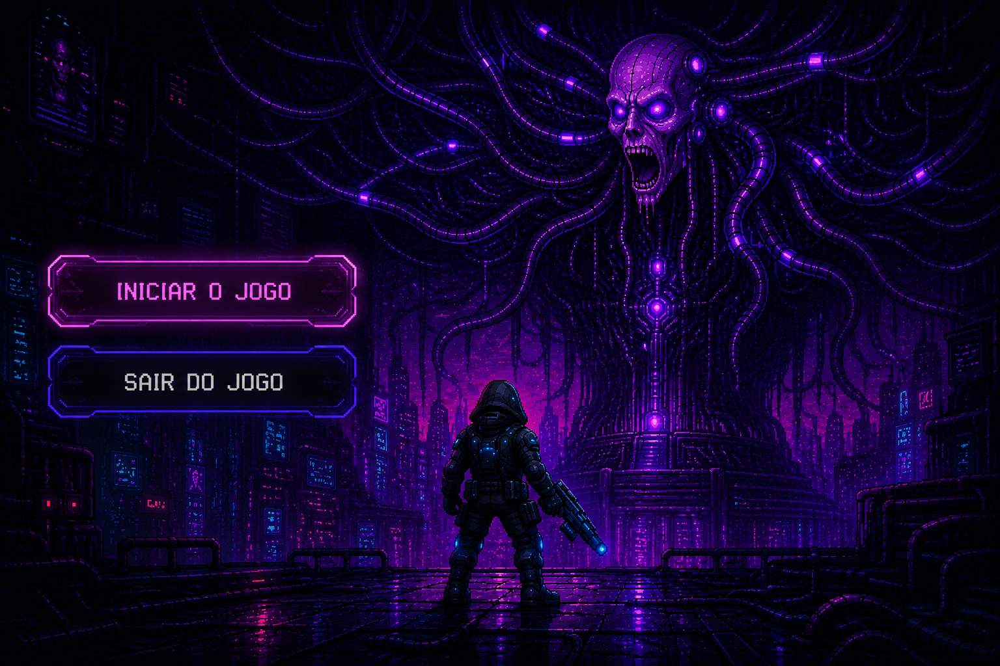

# Last Sign of Freedom

**Last Sign of Freedom** é um protótipo jogável de plataforma 2D com ação e ambientação cyberpunk, desenvolvido em **Godot** com **GDScript**.

O jogador controla um personagem armado que atravessa instalações hostis em busca de liberdade. A experiência combina movimentação lateral, saltos, combate com tiros, munição limitada, inimigos em patrulha, progressão por portas e um confronto final contra um chefe.



## Sobre o jogo

O jogo foi criado como um projeto acadêmico e busca entregar um ciclo completo de gameplay: iniciar a partida, explorar a fase, eliminar inimigos, liberar a passagem, enfrentar o chefe, perder ou vencer.

A proposta narrativa coloca o jogador como um sujeito experimental tentando escapar de um ambiente tecnológico e opressor. A direção visual usa elementos de ficção científica, cenários industriais, pixel art, luzes neon e interfaces simples para reforçar a atmosfera cyberpunk.

## Gameplay

- Plataforma 2D com movimentação lateral.
- Mira e disparo direcionados pelo mouse.
- Munição limitada com coletáveis para recarga.
- Inimigos que patrulham, detectam o jogador e atiram.
- Porta que só abre após derrotar todos os inimigos da fase.
- Sistema de checkpoint entre fases.
- HUD com tempo de partida e munição.
- Menu inicial, pausa, tela de game over e tela de vitória.
- Batalha final contra um chefe com vida, patrulha, perseguição e projéteis.

## Controles

| Ação | Teclas / Comando |
| --- | --- |
| Mover para a esquerda | `A` ou seta esquerda |
| Mover para a direita | `D` ou seta direita |
| Pular | `W`, seta para cima ou `Espaço` |
| Mirar | Mouse |
| Atirar | Botão esquerdo do mouse |
| Pausar | `Esc` |

## Imagens

### Fase inicial


### Porta liberada


### Covil do chefe


### Ataque do chefe


## Como executar

1. Instale o Godot 4.6 ou uma versão compatível do Godot 4.
2. Clone este repositório:

```bash
git clone <url-do-repositorio>
```

3. Abra o Godot.
4. Selecione **Importar**.
5. Escolha o arquivo `project.godot` na raiz do projeto.
6. Execute a cena principal pelo editor.

O projeto está configurado para iniciar pelo menu principal.

## Estrutura do projeto

```text
assets/                 Assets visuais, sons, fontes e tilesets
docs/                   Imagens e materiais de documentação
src/components/         Componentes reutilizáveis de colisão
src/entities/           Jogador, inimigos e chefe
src/objects/            Balas, armas, portas e coletáveis
src/scenes/             Fases jogáveis
src/singletons/         Estado global e checkpoint
src/ui/                 HUD, menus e telas de fluxo
project.godot           Configuração do projeto Godot
```

## Principais sistemas

- **Personagem:** movimentação, salto, disparo, controle de munição, cronômetro e morte por queda ou projéteis.
- **Inimigos:** patrulha, detecção do jogador, ataque à distância e animação de morte.
- **Chefe:** comportamento flutuante, perseguição, ataque com projéteis, vida própria, feedback de dano e transição para vitória.
- **Portas:** verificam se todos os inimigos foram derrotados antes de liberar a passagem.
- **Checkpoint:** permite reiniciar a partir da fase atual após a derrota.
- **Interface:** exibe munição, tempo, pausa, game over e vitória.

## Tecnologias

- Godot 4.6
- GDScript
- Cenas 2D com `CharacterBody2D`, `Area2D`, `AnimatedSprite2D`, timers e grupos
- Assets em pixel art, efeitos sonoros e imagens de interface

## Status

Protótipo funcional com duas etapas principais:

1. Uma fase inicial com plataformas, soldados inimigos, munição e porta de progressão.
2. Uma arena final dedicada ao confronto contra o chefe.

O projeto pode ser expandido com novas fases, sistema de vida ou escudo para o jogador, narrativa mais detalhada, balanceamento de dificuldade, novas trilhas e mais efeitos sonoros.

## Licença

Este repositório ainda não possui uma licença definida. Antes de reutilizar código, imagens ou sons, verifique as permissões dos autores e dos assets utilizados.
